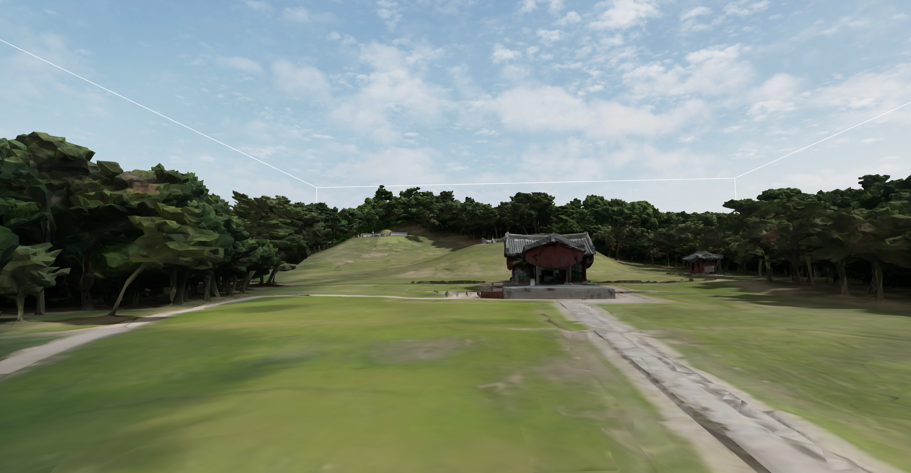

# West Five Royal Tombs World Model (서오릉 월드 모델)

PX4 SITL + Gazebo Harmonic 환경에서 사용 가능한 **서오릉(西五陵, West Five Royal Tombs) Gazebo 시뮬레이션 월드** 패키지입니다.

---

## 개요

경기도 고양시에 위치한 조선 왕릉 **서오릉**을 기반으로 제작된 Gazebo 시뮬레이션 월드입니다.  
실제 문화재 3D 모델을 활용하여 자율 비행 및 로봇 연구를 위한 환경을 제공합니다.

---

## 디렉토리 구조

```
West_Five_Royal_Tombs_model/
├── tomb.sdf                          # 메인 월드 파일 (standalone)
├── tomb/
│   ├── model.config                  # Gazebo 모델 메타데이터
│   ├── model.sdf                     # Gazebo 모델로 사용 시 월드 파일
│   └── meshes/
│       ├── West_Five_Royal_Tomb.dae  # 서오릉 3D 비주얼 메시 (Collada)
│       ├── West_Five_Royal_Tomb.stl  # 서오릉 충돌 메시 (STL)
│       └── HS198_West_Five_Royal_Tombs,_Goyang_low.jpg  # 텍스처 이미지
└── README.md
```

---

## 월드 설정

| 항목 | 값 |
|------|-----|
| SDF 버전 | 1.9 |
| 물리 엔진 | ODE |
| 업데이트 레이트 | 250 Hz |
| 스텝 크기 | 0.004 s |
| 중력 | 9.8 m/s² |
| 좌표계 | WGS84 / ENU |
| 모델 스케일 | 0.85× |

---

## 요구 사항

- [Gazebo Harmonic](https://gazebosim.org/docs/harmonic/install/)
- [PX4-Autopilot](https://docs.px4.io/main/en/dev_setup/dev_env.html) (PX4 SITL 연동 시)
- [ROS 2 Humble](https://docs.ros.org/en/humble/Installation.html) (ROS 2 연동 시)

---

## 설치

### 1. PX4 worlds 디렉토리로 이동 후 클론

```bash
cd ~/PX4-Autopilot/Tools/simulation/gz/worlds
git clone https://github.com/ksh5568/Seooreung_world.git
```

### 2. 월드 파일 배치

클론한 저장소 안의 파일들을 `worlds/` 디렉토리로 이동합니다.

```bash
mv West_Five_Royal_Tombs_model/tomb.sdf .
mv West_Five_Royal_Tombs_model/tomb ./
```

완료 후 디렉토리 구조는 다음과 같아야 합니다.

```
PX4-Autopilot/Tools/simulation/gz/worlds/
├── tomb.sdf        # 월드 파일
├── tomb/           # 모델 디렉토리 (model.config, model.sdf, meshes/)
└── ...             # 기존 PX4 월드 파일들
```

---

## 실행

### PX4 SITL 연동 실행

PX4-Autopilot 루트 디렉토리에서 실행합니다.

```bash
PX4_GZ_WORLD=tomb PX4_GZ_MODEL_POSE="0,0,3.8" make px4_sitl gz_x500
```

### Gazebo 단독 실행

```bash
export GZ_SIM_RESOURCE_PATH=$GZ_SIM_RESOURCE_PATH:~/PX4-Autopilot/Tools/simulation/gz/worlds
gz sim ~/PX4-Autopilot/Tools/simulation/gz/worlds/tomb/model.sdf
```

---

## 저자

- **Seonghyun Kim** — kimsh315331@kau.kr

---

## 출처

- [국가문화유산포털 - 서오릉 (HS198)](https://digital.khs.go.kr/heri/heriDetail.do?ctptUid=13898859675391300816&ctptNo=1333101980000)

---

## 라이선스

본 프로젝트는 한국항공대학교 내부 연구 목적으로 제작되었습니다.
